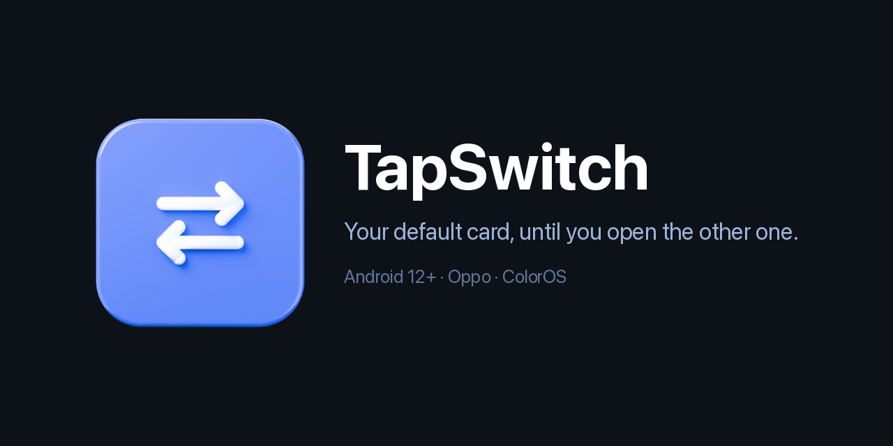

  

  
  
  
  
  

  No settings to change · No app to open · No account

***

## The problem

Your phone can present **one** NFC card at a time.

Set your building's access card as the default and tap-to-pay stops working. Set Google
Wallet as the default and your door stops opening. Android has no "use the payment app
while it's open" behaviour on these phones, so you end up digging through the NFC settings
several times a day.

## What TapSwitch does

Holds your **access card** as the phone's NFC default, and hands over to **Google Wallet**
as soon as you open it. Switch to another app and it hands straight back.

If your screen simply times out while Wallet is open, TapSwitch keeps the payment card
ready for about a minute, so waking the phone at the till still pays. After that it returns
to your access card on its own.

You never open TapSwitch. You never change a setting. Doors work, paying works.

Prefer it the other way round? **Reverse mode** makes Google Wallet the permanent default
and lets the access card take over only while its own app is on screen.

***

## Install

**[Download the latest release](https://github.com/jugal1990/tapswitch-releases/releases/latest)**, and take
**`TapSwitch-Setup-START-HERE.zip`**.

The bare `TapSwitch-advanced-only.apk` next to it is for updating an install you already have.
On a fresh phone it installs but cannot work, because nothing grants it the permission below.

Setup needs a computer once. ColorOS blocks the permission TapSwitch needs from being
granted on the phone alone, so a small installer grants it over USB. After that the app runs
on its own, and updates never need a computer again.

| Step | Where | What |
| --- | --- | --- |
| 1 | Phone | Settings, About device, **Version**, then tap **Build number** seven times |
| 2 | Phone | Settings, Additional settings, Developer options, turn on **USB debugging** |
| 3 | Both | Plug the phone into the computer |
| 4 | Computer | Run `Install-TapSwitch-Mac.command` or `Install-TapSwitch-Windows.bat` |
| 5 | Phone | Tap **Allow** on the USB debugging prompt |

The app opens with four green checks. Make sure the switch at the top is on. That is it.

> The installer downloads Google's official `platform-tools` the first time if you don't
> already have it, which adds a moment on first run. Nothing else leaves your computer.

***

## Free for 14 days

TapSwitch works fully for 14 days. The clock starts the first time it is actually running,
not when you download it, so there is no rush between the two.

When the trial ends, TapSwitch puts your **access card back** as the NFC default and stops
switching. Nothing breaks: your doors work exactly as they did before you installed it. The
only thing that stops is the automation.

To keep it, tap **Get the full version** in the app. Your device ID is filled in for you.
Send the message and you will get a link back that unlocks it in one tap. Since this is a 
closed source project, there will be a fee for unlimited access. I have yet to decide how much. 

| | |
| --- | --- |
| **Tied to your phone** | A code works on one handset and nowhere else |
| **Never expires** | No subscription, no renewal, no account |
| **Survives a reinstall** | Uninstall the app or clear its data, your unlock returns |
| **No server** | Your unlock is verified on the phone, never checked online |

Your code is shown again any time under **About**, so you can keep it somewhere safe. A
factory reset gives the phone a new identity, so that does need a fresh code.

***

## Updates

Install over the top. Your settings, permissions and unlock are all kept, and no computer is
involved.

The app tells you under **About** when a newer version exists. If you would rather it
happened by itself, point [Obtainium](https://github.com/ImranR98/Obtainium) at this
repository and it will track releases for you.

***

## Good to know

- **Screen on.** Access cards of this kind only respond while the screen is on. That is how
  the phone works, with or without TapSwitch.
- **Reverse mode and doors.** In reverse, the access card is only the default while its app
  is open, so doors need the screen on and that app in front.
- **Something not working?** **About**, then **Report a problem**, writes a diagnostic log
  into the message for you, so a bug report does not have to start with twenty questions.
- **Main profile only.** TapSwitch does not run in a cloned app, Second Space or a work
  profile. Android keeps NFC settings separate per profile, so a copy running there could
  not change the card your phone actually presents.
- **Built for ColorOS.** Oppo phones on Android 12 or newer. Other Android
  phones may work but are untested. You are welcome to try it and send feedback!

***

## What's in this repository

Built releases only. The app's source is private. `latest.json` is the version manifest that
the in-app update check reads.
